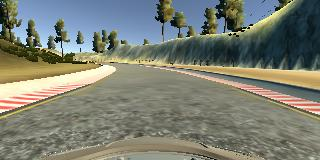
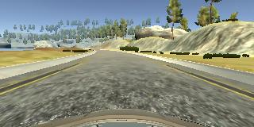
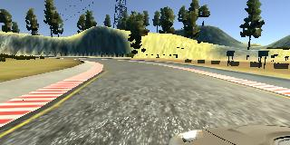

# **Behavioral Cloning**
---

**Behavioral Cloning Project**

The goals / steps of this project are the following:
- Use the simulator to collect data of good driving behavior
- Build, a convolution neural network in Keras that predicts steering angles from images
- Train and validate the model with a training and validation set
- Test that the model successfully drives around track one without leaving the road
- Summarize the results with a written report

### See the End Result!
Link to YouTube Video:
https://youtu.be/zdgAPUDvfLQ

### Sample images
**Normal Image**



**Recovery Image | Left Camera Position**


**Recovery Image | Right Camera Position**


## Rubric Points
### Here I will consider the [rubric points](https://review.udacity.com/#!/rubrics/432/view) individually and describe how I addressed each point in my implementation.  

---
### **Files Submitted & Code Quality**
#### 1. Submission includes all required files and can be used to run the simulator in autonomous mode

My project includes the following files:
- model.py containing the script to create and train the model
- drive.py for driving the car in autonomous mode
- model.h5 containing a trained convolution neural network
- writeup.md summarizing the results

#### 2. Submission includes functional code
Using the Udacity provided simulator and my drive.py file, the car can be driven autonomously around the track by executing
```sh
python drive.py model.h5
```

#### 3. Submission code is usable and readable

The model.py file contains the code for training and saving the convolution neural network. The file shows the pipeline I used for training and validating the model, and it contains comments to explain how the code works.


### **Model Architecture and Training Strategy**
#### 1. An appropriate model architecture has been employed

My model consists of a convolution neural network with 3x3 and 5x5 filter sizes, 2x2 and 1x1 pooling layers, and depths between 24 and 64 (model.py lines 90-111)

The model includes RELU layers to introduce nonlinearity, and the data is normalized in the model using a Keras lambda layer (code line 95).

Furthermore, the top 70 and bottom 25 pixels of each image is cropped using the Keras Cropping2D function. This removes unnecessary detail from the image focusing on just the road.

#### 2. Attempts to reduce overfitting in the model

To prevent overfitting, data was augmented by flipping images using OpenCV's cv2.flip() and inverting the the steering angle. This doubled the amount of training data. Furthermore, an l2 regularizer was used which minimizes the parameters.

#### 3. Model parameter tuning

The model used an adam optimizer, so the learning rate was not tuned manually (model.py line 25) but different batch sizes were tested and 32 samples per batched proved to be the most effective.

#### 4. Appropriate training data

By driving a car in a simulator, training data was captured to train a neural network to drive a vehicle in the center of a road. Left, center and right camera angles were used for training the model. Specifically, data from the left and right camera positions were used to teach the model how to recover when it deviated from the center of the road. When gathering recovery training data in real life, left and right camera angles have to be used as vehicles cannot be driven partially on the road side of the road as it is against the law.

In addition to the three cameras angles, the images were augmented by flipping the images and inverting their steering angles doubling the amount of data without having to drive the vehicle on another track.


### **Model Architecture and Training Strategy**
#### 1. Solution Design Approach

The overall strategy for deriving a model architecture was by following the suggested methods mentioned in the Udacity tutorial videos. The videos introduced various individual suggestions such as the use of generators, architectural structures, data pre-processing, and augmentation. These individually suggested methods were merged together and altered to achieve the results I did.

My first step was to use a convolution neural network model similar to the LeNet model. I thought this model would be an appropriate starting point for driving the car in the simulator. After testing the model in the simulator, I progressed to the same architecture used by Nvidia for their autonomous driving software. This proved to be a better model which was able to drive more smoothly and in the center of the road.

In order to gauge how well the model was working, I split my image and steering angle data into a training and validation set. I found that my first model had a low mean squared error on the training set but a high mean squared error on the validation set. This implied that the model was overfitting.

To combat the overfitting, I augmented the data by flipping the images and inverting the steering angles. This provided double the training data.

Due to the increase in data and thus the increase in memory usage, a generator was used to pass the data in batches of 32 samples. This allowed the model to be trained on a bigger dataset without increasing my instance storage size.

The final step was to run the simulator to see how well the car was driving around track one. Initially, there were a few spots where the vehicle fell off the track; however, after augmenting the data and reducing the number of epochs the vehicle is able to drive autonomously around the track without leaving the road.

#### 2. Final Model Architecture

The final model architecture (model.py lines 92-111) consisted of a convolution neural network with the following layers and layer sizes:

**Layer 1**
Lambda

**Layer 2**
Cropping 2D

**Layer 3**
Convolutional Layer
- Kernel: 5x5
- Stride: 2x2
- Depth: 24

**Layer 4**
Convolutional Layer
- Kernel: 5x5
- Stride: 2x2
- Depth: 36

**Layer 5**
Convolutional Layer
- Kernel: 5x5
- Stride: 2x2
- Depth: 48

**Layer 6**
Convolutional Layer
- Kernel: 3x3
- Stride: 1x1
- Depth: 64

**Layer 7**
Convolutional Layer
- Kernel: 3x3
- Stride: 1x1
- Depth: 64

**Layer 8**
Flatten

**Layer 9**
Dense layer:
- Depth: 100
- Regularizer: L2(0.1)

**Layer 10**
Dense layer:
- Depth: 50
- Regularizer: L2(0.1)

**Layer 11**
Dense layer:
- Depth: 10

**Layer 12**
Dense layer
- Depth: 1


#### 3. Creation of the Training/Validation/Test Set & the Training Process

To capture good driving behavior, I first recorded two laps on track one using center lane driving. Here is an example image of center lane driving:

**Center Camera View**



In order to teach the model how to recover back to the center of the road, left and right camera views were used as seen below:

**Left Camera View**



**Right Camera View**


After the collection process, I had ~ 40,000 sample images. The images were normalized using "x / 127.5 - 1." Lastly, 20% of the sample images were used as a validation set.

I used this training data for training the model. The validation set helped determine if the model was over or under fitting. The ideal number of epochs was 3 as the model began to overfit at a higher epoch. I used an adam optimizer so that manually training the learning rate wasn't necessary. Next, I tested the models performance at driving in the simulator.
